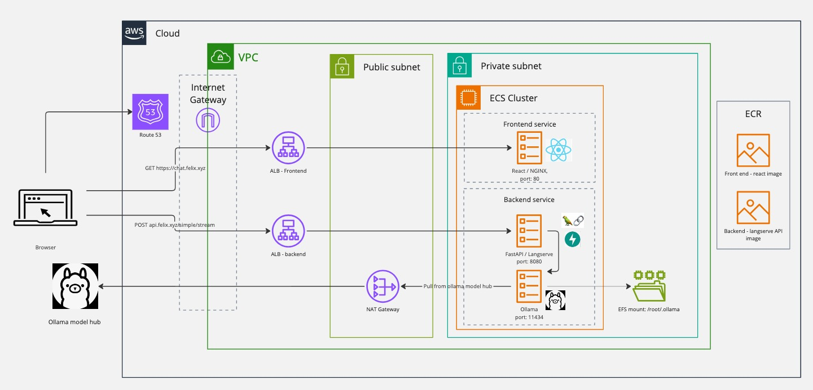

# Deploying a chat bot

This project was used to learn how to deploy a language model, using mainly the following:
 - IaC (Terraform)
 - Docker
 - Langchain/Langserve
 - Ollama
 - AWS Elastic Container Service

## Architecture



## Some useful dev commands

Install pre-commit hooks
```
python -m venv venv
source venv/bin/activate
pip install pre-commit
pre-commit install
```

### Run locally

```
docker-compose up
```

### Build and push images to ECR

```
sh scripts/build-push.sh
```

### Deploy all services
```
sh scripts/deploy-all.sh
```

### Debugging

Access terminal in a task container

```
aws ecs execute-command \
--region eu-west-2 \
--cluster langserve-app-cluster \
--task <TASK ID> \
--container langserve-app-container \ # or ollama-container
--command "/bin/bash" \
--interactive
```

## Infra

Infra not managed by terraform
- The S3 bucket which holds the terraform state files
- The Route 53 hosted zone

Outstanding Questions
- How do albs access private subnets
- Do you need nginx and alb, whats the difference
- Route 53 points to albs, which have https listeners, but the alb dns is still callable in browser over http, how?
- Do you tend to deploy to default VPC (cheaper?)


## Todo

- Use an API gateway to front the app
- Manage ollama model loading with a lambda
- Switch front end to use serverless
- What does df -h actaully show, what is the nvidia smi thing which is 30GB?

## Done
- Switch Ollama container from fargate to provisioned ec2 with GPU enabled
