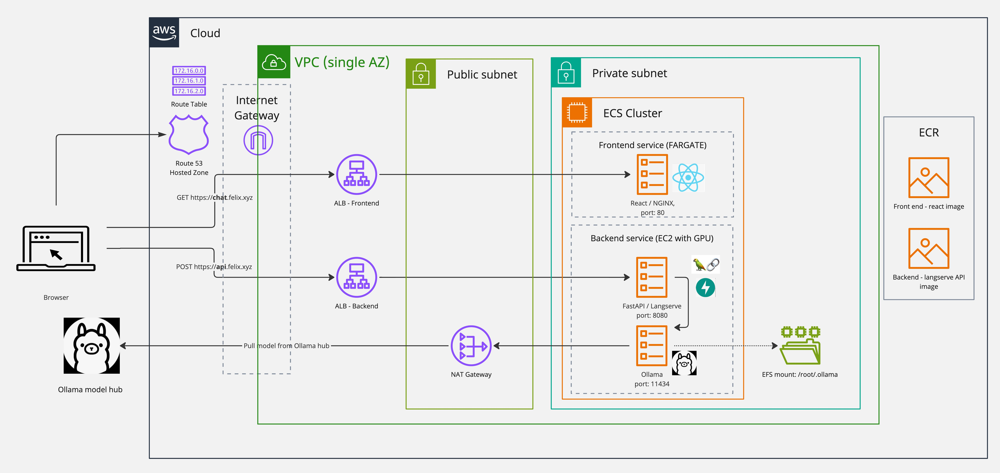

# Deploying a chat bot
This project was used to learn how to deploy a language model, using mainly the following:
 - IaC (Terraform)
 - Docker
 - AWS Elastic Container Service
 - Langchain/Langserve
 - Ollama

## The Web App

App is accessible at https://chat.felixcs.xyz (only when deployed, which is rarely to keep my aws bill to a minimum)

There are two modes corresponding to two different very simple langchain chains:
- Chat - just pass user question straight to the model
- Interview - wrap user question with a prompt template with info about me and encorage it to respond in a positive way

Chat mode            |  Interview mode
:-------------------------:|:-------------------------:
  |  


## Architecture

The app is hosted on AWS, with two ECS services:
- Backend service:
    - A container running the Ollama docker image. This holds the model for inference.
    - A container running a FastAPI app using langserve to easily create endpoints from langchain chains. The chains make calls to
    the ollama container to get model responses. On startup the app makes a pull request to the ollama container to download the model from Ollama model hub.
    This model is then persisted to EFS so this download does not need to happen when ECS tasks stop/start.
- Front end - a container running nginx which serves the React app. This app makes calls to the FastAPI backend service.



## Some useful dev commands

Install pre-commit hooks
```
python -m venv venv
source venv/bin/activate
pip install pre-commit
pre-commit install
```

### Run locally

```
docker-compose up
```

### Build and push images to ECR

```
sh scripts/build-push.sh
```

### Deploy all services
```
sh scripts/deploy-all.sh
```

### Debugging

Access terminal in a task container

```
aws ecs execute-command \
--region eu-west-2 \
--cluster langserve-app-cluster \
--task <TASK ID> \
--container langserve-app-container \ # or ollama-container
--command "/bin/bash" \
--interactive
```

## Infra

Infra not managed by terraform
- The S3 bucket which holds the terraform state files
- The Route 53 hosted zone

## Todo

- Use an API gateway to front the app
- Manage ollama model loading with a lambda instead of fastAPI startup
- Switch front end to use serverless
- Should alb dns's be callable in browser over http?

## Done
- Switch Ollama container from fargate to provisioned ec2 with GPU enabled
